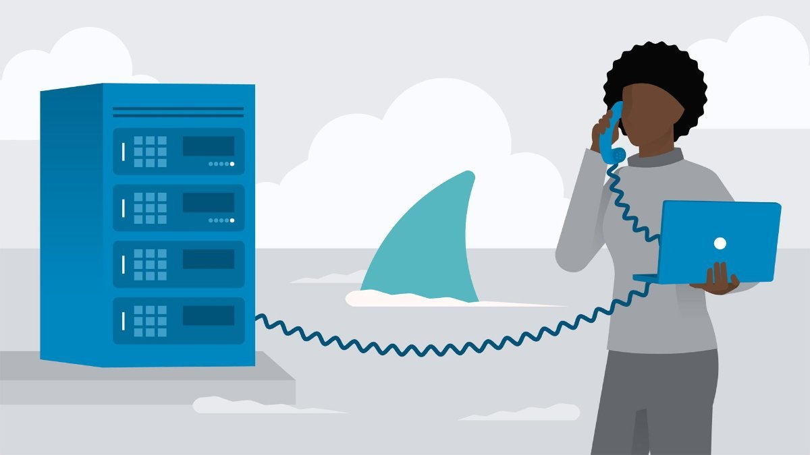
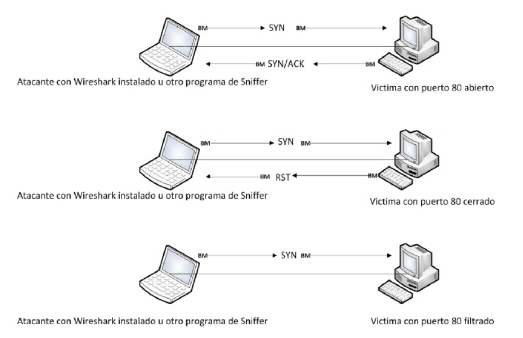

# Análisis de tráfico con Wireshark





Trabajo realizado por: 

```

	- Silvia Cazalla Bazán
	- Jose María López Serrano

``` 


**Índice**
 
	1. Introdución.
		1.1. Justificación.]
	2. Utilidades analizador de red (Wireshark).
	3. Metodología
		3.1. Filtros para la observación del tráfico deseado en las redes.
			3.1.1. Modo promiscuo.
			3.1.2. Escaneo y captura de paquetes.	
		3.2. Análisis y gráficos de los paquetes de datos.
	4. Importancia de la seguridad en los paquetes de datos para evitar ataques.
	5. Primeros paros con Wireshark
		5.1. Filtrado de paquetes de datos.
		5.2. Conjunto básico de filtros para el usuario administrador.
	6. Programas Empaquetados con Wireshark.
	7. Prácticas realizadas con Wireshark en el ordenador personal.
	8. Archivos adjuntos.

***


# 1. Introducción:


La complejida que estan alcanzando las redes informáticas y la exigencia en cuanto a 
la operación con las mismas es cada vez más grande y difícil para trabajar con ellas.
Además que estas redes cada vez deben ser capaces de soportar más tráfico entre las
máquinas, más servicios y programas...etc, por tanto es una labor importante monitorear
las redes evitando posibles problemas que puedan surgir, mejorando la calidad del servicio
para los usuarios en la red.

Wireshark implementa una amplia gama de filtros que facilitan la defnición de criterios de 
búsqueda para más de 1100 protocolos soportados actualmente, contando con una interfaz 
gráfica fácil e intuitiva. 

De este modo tambien conocer el trafico que concurre y su protocolo, para
evitar colapsos con trafico no deseado, mejorando el rendimiento de la red, facilitando el 
almacenamiento y procesamiento de la información ya que nos permite compartir datos, de 
igual manera nos permite establecer los recursos a los que se puedan acceder en la red.


## 1.1. Justificación:

Wireshark es un software de grandes capacidades para el manejo de redes, soporta varios 
protocolos entre otras cualidades que se describirán a lo largo del trabajo.
Además cuenta con todas las características estándares de un analizador de protocolos y 
lo más importante es de licencia libre.

Otra motivación que nos hizo elegir el tema de trabajo de análisis de tráfico en 
Wireshark es que las redes son un tema de interés para nosotros y hemos trabajado 
bastante con ellas en nuestra universidad de origen.

Con este trabajo se pretende dar a conocer las funcionalidades básicas en el análisis y
captura de paquetes en una red mediante Wireshark a los usuarios interesados en las redes.
 

# 2. Utilidades analizador de red (Wireshark):

Antes de empezar a aprender como podemos analizar y filtrar el tráfico deseado, es importante
saber la multitud de utilidades que posee wireshark.
Este analizador de red puede ayudarnos en:

```
	- Detección de intrusos en nuestra red.
	- Descubrir cuellos de botella, con el análisis de rendimiento.
	- El análisis de las operaciones de las aplicaciones.
	- Descubrir origen de la denegación de servicios o los virus.
	- Resolución de problemas en la red.

```


# 3. Metodología:

Wireshark implementa una amplia gama de filtros que facilitan la definición de criterios de
búsqueda gracias a que "entiende la estructura de los protocolos", podemos visualizar campos
de cada una de las cabeceras y desglosarlas, proporcionando un gran abanico de posibilidades
al administrados de redes a la hora de abordas ciertas tareas en el análisis de tráfico.

La metodología de wireshark se puede dividir en tres pasos, colección, conversión y analisis.

En la colección rastreamos los paquetes recogiendo los datos binarios del cable de red.
Por lo general esto se hace cambiando la interfaz de red seleccionada en modo promiscuo. En
este modo la tarjeta de red puede escuchar todo el tráfiico en un segmento de red, no
solamete el tráfico que sedirija a este.

En el paso de conversión, convertimos los datos binarios capturados en el paso anterior de 
forma que sean legibles, en este paso los datos de red pueden ser interpretados, aunque sólo
en un nivel muy básico, dejando la mayoría de los análisis para el usuario final.

Para finalizar el análisis, donde el usuario final tendría que encargarse del análisis real 
de la captuea y convertir los datos. El rastreador de red captura paquetes de datos, 
verifica su protocolo basado en la información extraida y comienza su análisis de las 
caracteríasticas del protocolo.

Por tanto utilizaremos la metodología inductiva porque es una herramienta de investigación 
que nos permitirá obtener resultaos específicos a partir de hechos generales; comenzando con
una parte de la investigación hasta terminar con la misma.

La metodología deductiva es una herramenta de investigación que considera que los hechos 
generales definen la investigación específica. La investigación deductiva es válida cuando
los hechos son verdaderos.


## 3.1. Filtros para la observación del tráfico deseado:

### 3.1.1. Modo promiscuo:

Para poder capturar paquetes en una red, se necesita una tarjeta de interfaz de res (NIC) 
que soporta un controlador en modo promiscuo. Este modo es lo que permite a una tarjeta
ver todos los paquetes que cruzan en la red. Sólo si estamos en este modo podemos asegurar
la captura de todo el tráfico independientemente de la dirección.

En nuestro caso resultaba imposible poner la tarjeta de red en modo promiscuo, ya que en 
el caso de windows no esta permitido. Si quisieramos obtener todo el tráfico que se 
genera por ejemplo en la comversación de dos pc, una manera sencilla sería descargar un 
servidor FTP/TFTP gratuito, o configurar uno de los pc para ello, una de las mejores
opciones para windows.

NIC más modernos soportan el modo promiscuo, y Wireshark incluye los controladores de
libcap/WinPcap, que le permite pasar su tarjeta de red en modo promiscuo directamente
desde la interfaz gráfica de Wireshark.

### 3.1.2. Escaneo y captura de paquetes:

Depende del tipo de análisis, pero a menudo se hace primero en contra de un sistema, es un
escaneo TCP SYN, también conocido como un escaneo de sigili o un análisis de medio abierto.
Un escaneo SYN es el tipo más común por varias razones;
	
```

	- Es muy rápido y fiable,
	- Es preciso entodas las plataformas, independientemente de la aplicación sobre TCP.
	- Es menos ruidoso que otras técnicas de escaneo.

```

El escaneo TCP SYN se basa en el proceso de negociación de tres vías para determinar qué 
puertos están abierto en un host destino. El atacante envía un paquete SYN TCP a un rango 
de puertos en la víctima, como si tratara de establecer un canal para la comunicación normal
en los puertos.

Una vez que este paquete es recibido por la víctima, una de las pocas cosas que pueden 
suceder es como se muestra en la imagen a continuación, posibles resultados de un escaneo
TCP SYN.




## 3.2. Análisis y gráficos de los paquetes:

El análisis es la parte fundamental del uso de Wireshark, para la interpretación de datos en 
tiempo real de lo que está sucediendo en la red.

Todos los problemas de red se reflejan en los paquetes, por lo que un buen conocimiento y
análisis de estos nos permitirán controlar la red y resolver sus problemas.

Para un buen análisis, no debemos capturar paquetes de datos sólo cuando existan problemas en
la red si no que debemos conocer el tráfico habitual y sin problemas de esa red para así tener
un punto de referencia a partir del cual poder comparar.

Una de las herramientas que Wireshark nos brinda para el análisis son los gráficos, que nos
permiten tener una visión general de los datos.

La ventana de gráficos permite analizar el rendimiento de los datos de la red, pudiéndose 
encontrar picos y momentos de calma en el rendimiento, observar retrasos y comparar flujos.

# 4. Importancia de la seguridad en los paquetes de datos para evitar ataques:

Es importante la implementación de medidas de seguridad y el análisis de nuestra red para
confirmar que no hay ningún intruso que pueda robarnos algo.

En cualquier momento podrían atacarnos con un programa de sniffer, más entendible como un 
atacante planea antes de realizar su objetio en la red, o la información.

# 5. Primeros pasos con Wireshark

Podemos descargarnos Wireshark desde la página https://www.wireshark.org/ de manera gratuita.
Para instalarlo hemos abierto el ejecutable y hemos mantenido la configuración que aparece de
manera predeterminada, haciendo clic en Continuar hasta finalizar la instalación.

Una vez instalado ya podemos comenzar a capturar paquetes. Lo primero que debemos hacer al 
iniciar Wireshark es elegir la conexión de red que queremos analizar.

foto

(En nuestro caso hemos elegido Wi-Fi)

Automaticamente veremos como la pantalla empieza a llenarse con una lista de paquetes. Wireshark
capturará cada paquete enviado hacia o desde tu sistema. 

Para detener la captura pulsaremos el boton rojo de la esquina superior derecha.

Los paquetes aparecerán por defecto en el orden en que han sido capturados y se mostraran una 
serie de propiedades dependiendo de las columnas activas en ese momento. Haciendo clic derecho 
en la barra donde aparecen las columnas podemos editarlas seleccionando la opción "Column 
Preferences".

Para realizar un filtro podemos usar la barra de texto que aparece justo encima de la lista 
de paquetes para escribir dicho filtro o seleccionar cualquier propiedad específica de un 
paquete haciendo clic derecho en ella, "Apply as Filter" y elegir si queremos que se añada 
por conjunción o por disyunción.

Otra opción interesante sería mostrar gráficas con Wireshark y lo haremos desde Statics.
Hemos visto dos tipos de gráficas:
```
I/O Graphs:
	Es un gráfico configurable por el usuario de los paquetes capturados, 
	pueden definirse hasta 5 gráficos de distintos colores.
	El eje X se medirá el tiempo y en el eje Y el número de paquetes por segundo.
Flow Graphs:
	Es un gráfico que muestra un diagrama temporal con el flujo de los paquetes 
	indicando la IP destino y origen de cada uno, indicando los bits de SYN, ACK, 
	FIN, además de otros datos relevantes en el margen derecho.
```

### 5.1. Filtrado de paquetes de datos:

Los filtros permiten especificar exactamente qué paquetes tenemos disponibles para su 
análisis. Un filtro es una expresión que define los criterios para la inclusión o exclusión 
de los paquetes.
Estos filtros se utilizan durante el proceso de captura con la finalidad de mejorar el 
rendimiento.

Aunque el filtrado se puede realizar como hemos mencionado antes, durante captura, durante 
la visualización o después de guardar el paquete de datos que contienen las tramas obtenidas.

(Hay que añadir filtros y tipos de filtros de las practicas de redes y lo que se ocurra más)


### 5.2. Conjunto básico de filtros para el usuario administrador:

Wireshark cuenta con un gran número de filtros, los cuales podemos diferenciarlos 
principalmente por el tipo de protocolo que buscan, y dentro de estos hay distintas 
propiedades o características de dichos protocolos, las cuales ayudan bastante en 
cualquier búsqueda específica.

Se puede realizar un filtro con el nombre del protocolo:
```
 dns

```
Wireshark nos devolverá todas las tramas que sean
del protocolo dns. Después podemos y añadiendo más características como hemos mencionado
anteriormente, entre ellos:

```	
dns contains NOMBREWEB

```
el cual sólo nos mostrará tráfico dns asociado a la carga de dicha página web.

```	
Follow UDP Stream

```

nos devuelve las respuestas que ha recibido a la pregunta del Dns que se ha realizado.
Sabiendo el tráfico Dns, es posible conocer la IP de la página ya que el servidor DNS 
nos envia el registro CNAME donde aparece.

En una conexión persistente, con 

```
Follow TCP Stream

```
puede verse cuantos objetos de la página base se han solicitado en la conexión.

Si queremos observar conexiones entre el navegador y el servidor web, aplicamos un filtro
que muestre sólo las PDU del protocolo HTTP, dicho filtro se escribe igual 

```
http

```
y en este caso Wireshark nos permite ordenar el listado de tramas creando una columna
"SrcPort". 
Si la página con la que estamos trabajando ya ha sido visitada antes y no ha sido 
actualizada después de dicha visita, Wireshark no capturará nada, ya que estará guardado
en la caché del navegador y no tendrá que realizar ningún trámite con el servidor web.


UDP/TCP: Otro filtro bastante utilizado es

```
 udp or tcp

```
El cual devuelve sólo tramas del protocolo UDP o del TCP.

``` 
 (udp or tcp) and ip.addr==XXX.XX.XX.X

```
con el que nos aseguramos de que se trata del tráfico que va o viene de nuestra red.
	- Con lo que ya sabemos, si queremos visualizar el tráfico UDP y TCP este se 
	asocia a DNS, luego usamos: 

```
(dns or tcp) and ip.addr== XXX.XX.XX.X


```
Otra mejora con

```
 dns.qry.type==1

```
devolviendo el tráfico que se genera al preguntar por la IPv4.
	
- También podría realizarse con una palabra clave, si por ejemplo en nuestro 
caso, dicha palabra fuera "practica", escribiríamos el filtro

```
((dns.qry.type==1 and dns contains practica) or tcp) and ip.addr=XXX.XX.XX.X

```

- Se puede segir mejorando, sabiendo que la conexión para http se hace en el 
puerto 80

```
cambiar tcp por; tcp.port==80
```
Así eliminacmos las conexiones tcp que no sean del protocoloto http.

- Para que nos muestre segmentos tcp y sus flas, por ejemplo ACK;

```
tcp.flags.ack==o	tcp.flags.syn==1	tcp.flags.fin==1

```

Filtro para visualizar los mensajes ICMP

```
ip.addr==XXX.XX.XX.X and icmp

```

Ver sólo tramas con cierta expresión lógica
```
(eth.addr==Mac_de_mi_pc and arp) or (ip.addr==IP_de_mi_pc and icmp)

```


# 6. Programas empaquetados con Wireshark:

La instalación de Wireshark incluye otros programas de apoyo para comandos (Tshark) y ayuda para la manipulación, evaluación y creación de archivos de captura (editcap, mergecap, text2pcap, capinfos y Dumpcap).

Estos programas juntos permiten una potente manipulación de las capturas.

## 6.1. Tshark

Es la versión de línea de comandos de Wireshark. Permite capturar, decodificar e imprimir la pantalla de paquetes para guardar o leer los archivos de captura.

Tanto Tshark como Wireshark usan la misma biblioteca libpcap y casi el mismo código.

## 6.2. Editcap

Se usa para eliminar, para seleccionar paquetes desde un archivo y para convertir el formato de esos archivos. Sólo lee datos de un archivo guardado para crear un archivo de captura nueva; por defecto escribe en libpcap.

Tambien es capaz de leer archivos gzip comprimidos.

## 6.3. Mergecap

Es capaz de combinar varios archivos de captura en orden cronológico por defecto generando un único archivo de salida. Puede leer todos los archivos del mismo tipo y escribe en formato libpcap de manera predeterminada.

## 6.4. Text2pcap

Este programa lee ASCII hexadecimal y genera un archivo de captura libpcap.

Tambien es posible leer hexdumps de nivel de aplicación.

## 6.5. Capinfos

Es otro programa de línea de comandos que analiza un archivo de captura además de las estadísticas relacionadas con el número de paquetes, tamaño y demás información.

Capinfos puede tener dos tipos de salidas. La salida larga, adecuada para que sea leida por una persona o el resultado en una tabla, útil para generar un informe adaptable a una hoja de cálculo o base de datos.

## 6.6. Dumpcap

Es una herramienta de volcado de tráfico de red. Permite capturar paquetes de datos de una red en vivo y escribirlos en un archivo. Utiliza las bibliotecas libpcap, Npcap o WinPcap para capturar el tráfico.

# 7. Prácticas realizadas con Wireshark en el ordenador personal:

Para probar el funcionamiento de Wireshark hemos probado a realizar distintos ejercicios básicos de captura de paquetes y análisis de 
los datos obtenidos.

## 7.1. Tramas DNS que han servido para traducir la dirección web www.kia.com

Sólo bastaría con usar el filtro 

```
DNS contains kia
```
Aunque podríamos obtener un filtro más ajustado buscando sólo los paquetes DNS que contengan el registro CNAME:

```
DNS.cname contains kia

```


## 7.2. Interpretación de una conexión

Vamos a mostrar las tramas generadas al entrar en la página web www.habanos.com

Para ver los puertos origen y destino hemos creado dos columnas nuevas.


A continuación crearemos un filtro para escuchar sólo los paquetes que usen el puerto 80.

```
(tcp.dstport == 80) || (tcp.srcport == 80)
```
Si queremos ver solo las peticiones GET:

```
((tcp.dstport == 80) || (tcp.srcport == 80)) and http.request.method == GET
```
Vamos a seguir el tráfico HTTP del primer GET, que corresponde a la trama 443 con Follow HTTP Stream.

fotooo

Esto nos genera un filtro con toda la comunicación que produce ese GET y nos muestra en código ASCII de manera predeterminada dicha conversación, distinguiendo en rojo y azul los mensajes del emisor y el receptor respectivamente.


# 8. Archivos adjuntos.
  


