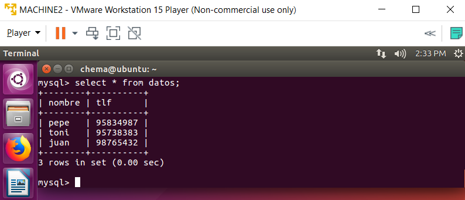
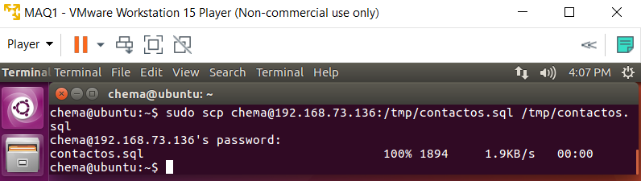
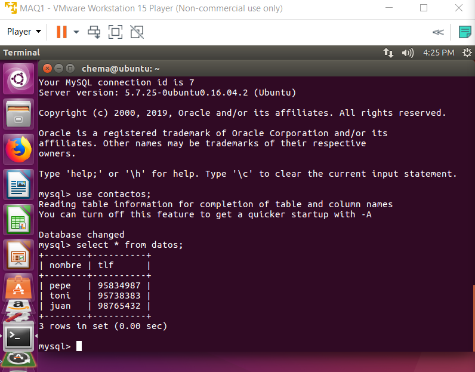
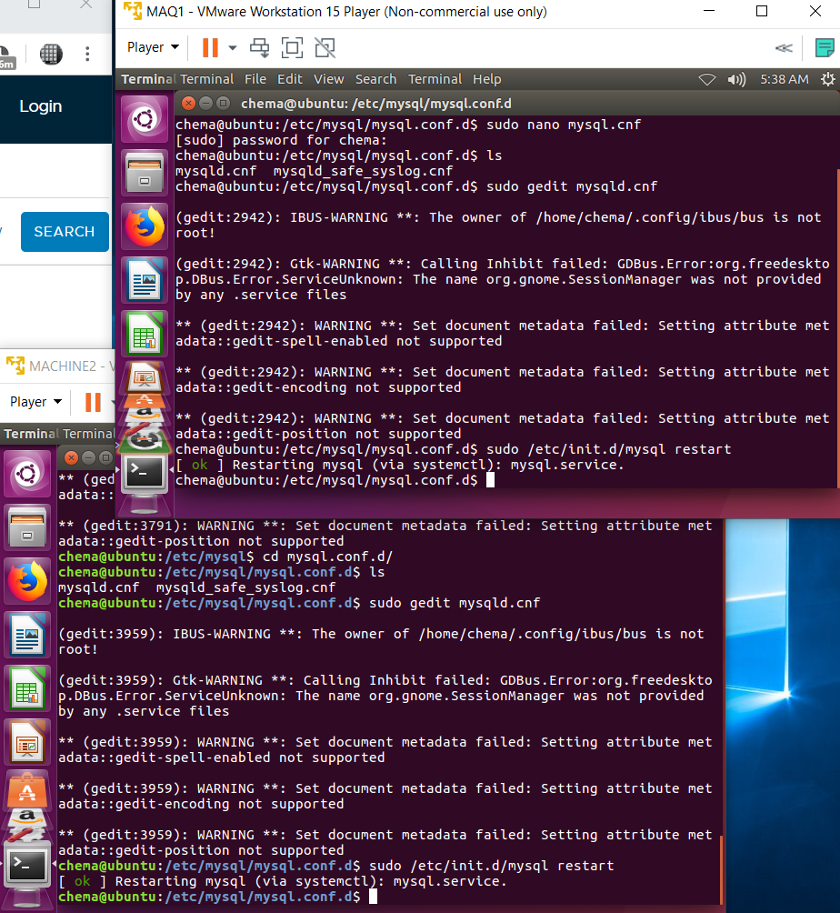

## Práctica 5: Replicación de bases de datos MySQL

# Crear BD e insertar datos

Instalámos la versión 5.7 de mysql con:

```
sudo apt install mysql-client-core-7.7
```

Para conectarnos a mysql hemos usado el siguiente comando:

```
mysql -u root -p
```

Creamos una base de datos llamada "contactos" y la seleccionamos:

```
mysql> create database contactos;

mysql> use contactos;
```
A continuación hemos creado una tabla de datos con nombre y telefono:

```
mysql> create table datos(nombre varchar(100), tlf int);
```

E insertamos varios registros usando esta estructura:


```
mysql> insert into datos(nombre,tlf) values ("pepe",95734987);
```




# Replicar una BD MySQL con mysqldump y clonado manual

Primero hemos bloqueado la BD

```
mysql> FLUSH TABLES WITH READ LOCK;
```
Salimos de MySQL y usamos mysqldump de esta forma para guardar datos:


```
mysqldump contactos -u root -p > /root/contactos.sql
```

Y volvemos a desbloquear las tablas con un UNLOCK TABLES en mysql.

En este momento hemos ido a la máquina secundaria para copiar el archivo .sql desde 
la máquina principal con un scp.



Para poder tener la base de datos "contactos" en la máquina esclava debemos crearla 
vacía inicialmente y salir de mysql para usar el comando:

```
mysql -u root -p contactos < /tmp/contactos.sql
```
Mostramos la base de datos copiada a la máquina secundaria:



# Replicación de BD con configuración maestro-esclavo automática

Primero debemos cambiar el archivo de configuración, en mi caso /etc/mysql/mysql.conf.d/mysqld.cnf

Añadiendo las siguientes líneas:

```
log_error = /var/log/mysql/error.log
server-id=1
log_bin = /var/log/mysql/bin.log
```
Y reiniciamos mysql:

```
/etc/init.d/mysql restart
```



Hacemos lo mismo para la máquina esclavo pero con server-id=2 y reiniciamos.

A partir de aquí tuvimos problemas para continuar, perdimos la conexión de red de todas nuestras máquinas 
virtuales y tuvimos que reinstalar VMWare.


Se reinstaló VMWare y vlvimos a tener conexión, repetimos varias veces la práctica ya que el último punto da error, y no hemos conseguido solucionarlo.


